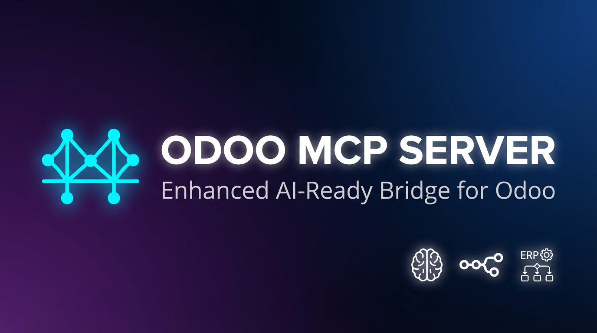
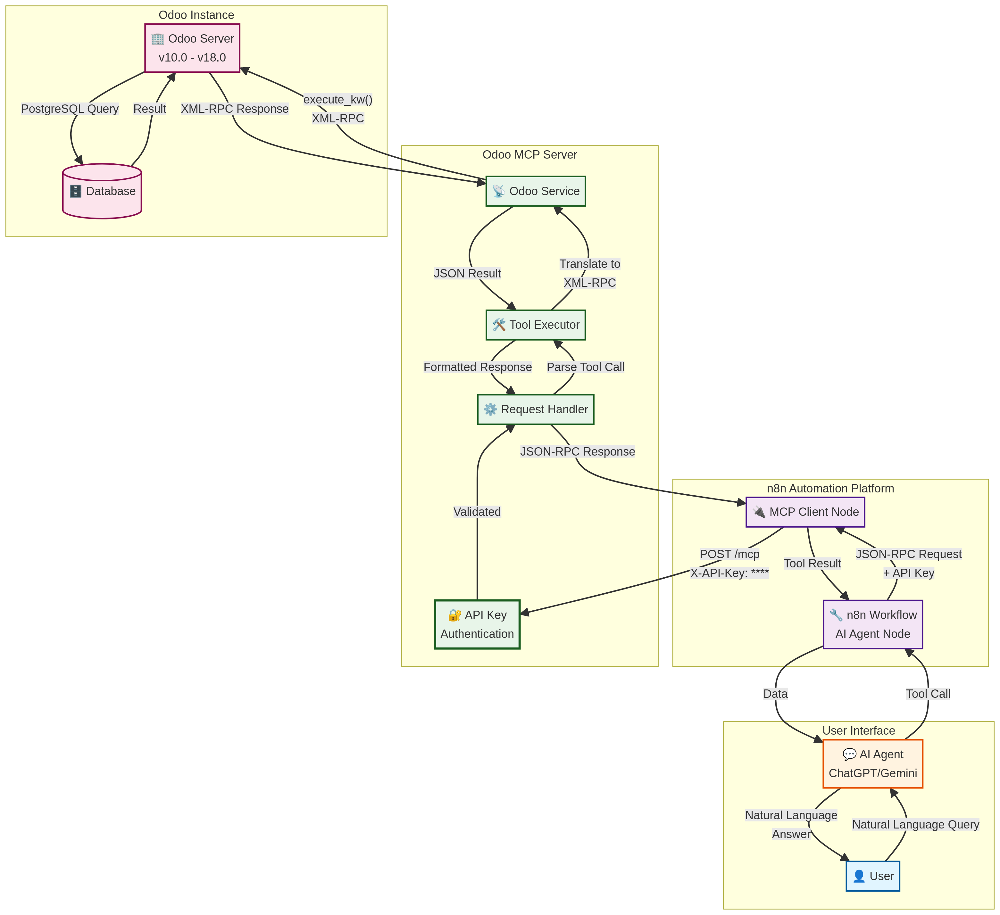

# Odoo MCP Server (Enhanced for AI Agents)

 <!-- Replace with a real banner image -->

[](https://opensource.org/licenses/MIT)
[](https://www.python.org/downloads/)
[](https://www.docker.com/)
[](https://www.odoo.com/)

---

## Introduction

This project provides an enhanced, production-ready **Odoo MCP (Middleware/Connector/Proxy) Server**, designed to act as a secure and intelligent bridge between your Odoo instance and modern AI agents like **ChatGPT** and **Google Gemini**, especially within automation platforms like **n8n**.

This server exposes a secure, JSON-RPC 2.0 compliant API that translates simple, standardized requests into complex Odoo XML-RPC commands. This allows AI agents to safely and effectively query and manipulate your Odoo data without needing direct access to your Odoo instance.

### Key Features

- **AI Agent Ready:** Provides a clear, well-defined set of tools for AI agents to interact with Odoo.
- **Secure:** Implements API Key authentication to protect your Odoo data from unauthorized access.
- **Robust:** Includes comprehensive error handling to provide clear feedback to the AI agent.
- **High-Performance:** Built on FastAPI for asynchronous, high-throughput performance.
- **Easy to Deploy:** Comes with a simple, Docker-based deployment process.
- **Broad Odoo Compatibility:** Designed to be a general-purpose solution for Odoo versions 10.0 through 19.0.

### MCP tool surface

The MCP server currently exposes the following tools over XML-RPC:

- `search_records`, `get_record`, `create_record`, `update_record`, `delete_record` — CRUD helpers that wrap `search_read`, `read`, `create`, `write`, and `unlink`.
- `get_model_fields` and `list_models` — schema discovery helpers via `fields_get` and `ir.model`.
- `execute_kw` — a generic passthrough to any model method with positional/keyword arguments and optional `context`.
- `get_server_info` — fetches `common.version()` and `common.about()` for capability discovery.
- `list_databases` — lists databases exposed by the `/xmlrpc/2/db` endpoint (requires sufficient privileges).
- `render_report` — calls the `/xmlrpc/2/report` endpoint to render reports by technical name and document IDs.

---

## Acknowledgements

This project is an enhanced version of the original `odoo-mcp-server` created by **Václav Zeman**. We extend our sincere thanks to him for providing the excellent foundation for this project.

This enhanced version was fixed and improved by **Mahmoud Abdel Latif** to be a more general-purpose, secure, and AI-ready solution for the Odoo, n8n, and AI communities.

---

## How It Works

The Odoo MCP Server acts as a secure intermediary:

1.  **AI Agent (ChatGPT/Gemini):** The AI agent, running in a platform like n8n, decides it needs to query Odoo.
2.  **n8n Workflow:** The AI agent calls a tool in its n8n workflow.
3.  **MCP Client Node:** The n8n MCP Client node sends a secure, JSON-RPC request to the Odoo MCP Server, including the secret API Key.
4.  **Odoo MCP Server:** The server validates the API Key, receives the request, and translates it into a standard Odoo XML-RPC call.
5.  **Odoo Instance:** The MCP server executes the command on your Odoo instance.
6.  **Response:** The result is passed back through the chain to the AI agent, which then formulates a natural language response for the user.

 <!-- Replace with a real architecture diagram -->

---

## Deployment

### Prerequisites

- A server running a Linux distribution (e.g., Ubuntu 22.04)
- Docker and Docker Compose installed
- A running Odoo instance (version 10.0 to 19.0)

### Step 1: Clone the Repository

```bash
git clone https://github.com/mah007/odooMCP.git
cd odooMCP
```

### Step 2: Configure the Environment

Create a `.env` file in the root of the project directory:

```bash
cp docker-compose.example.yml .env
```

Now, edit the `.env` file with your specific configuration:

```bash
# Odoo Connection Details
ODOO_URL=https://your-odoo-instance.com
ODOO_DB=your_database_name
ODOO_USERNAME=your_odoo_user
ODOO_API_KEY=your_odoo_api_key_or_password
# TLS/SSL controls (set to "false" only for development against self-signed endpoints)
ODOO_VERIFY_SSL=true
ODOO_TIMEOUT=120

# MCP Server Configuration
MCP_HOST=0.0.0.0
MCP_PORT=8000
MCP_DEBUG=false
MCP_LOG_LEVEL=INFO

# NEW: API Key for MCP Server Authentication
# Generate a strong key with: openssl rand -hex 32
MCP_API_KEY=your_super_secret_mcp_api_key

# Cache Configuration
CACHE_ENABLED=true
CACHE_TTL=300
CACHE_MAX_SIZE=1000
```

### Step 3: Build and Run the Server

```bash
docker-compose up --build -d
```

### Step 4: Verify the Server is Running

Check the logs to ensure the server started correctly:

```bash
docker-compose logs -f
```

You should see a message like: `Uvicorn running on http://0.0.0.0:8000`.

---

## n8n Integration

1.  **Add the MCP Client Node:** In your n8n workflow, add the **MCP Client** node.
2.  **Configure the Endpoint:** Set the **Endpoint URL** to your server: `http://<your_server_ip>:8000`.
3.  **Add API Key Authentication:**
    -   **Authentication:** `Header Auth`
    -   **Name:** `X-API-Key`
    -   **Value:** Your `MCP_API_KEY` from the `.env` file.

---

## Feedback and Contributions

This project is made with ❤️ by **Mahmoud Abdel Latif** for the Odoo, n8n, and AI communities.

If you encounter any errors or bugs, or have suggestions for improvements, please [open an issue](https://github.com/mah007/odooMCP/issues) on the GitHub repository. We welcome all feedback and contributions!

---

## License

This project is licensed under the MIT License. See the [LICENSE](LICENSE) file for details.
