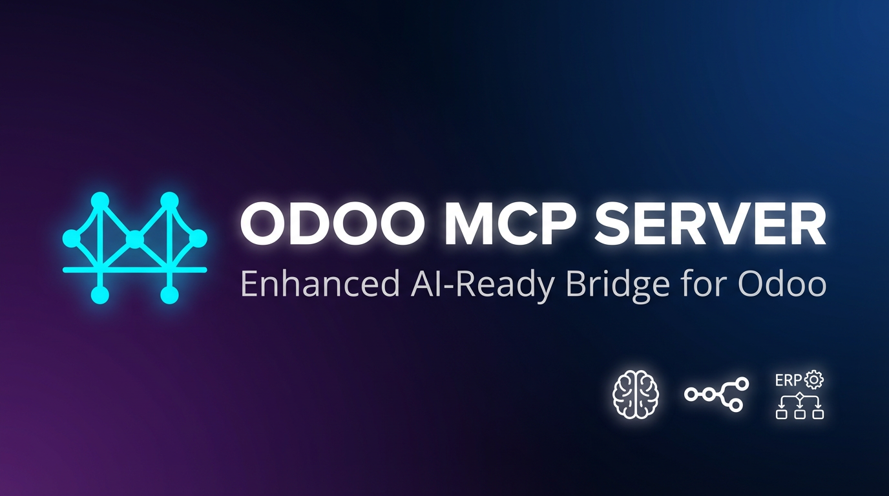
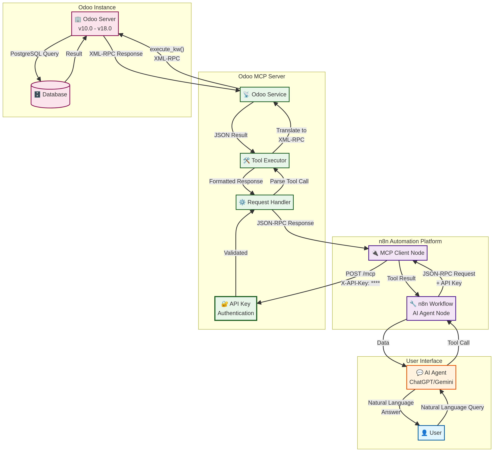

# Odoo MCP Server (Enhanced for AI Agents)

 <!-- Replace with a real banner image -->

[](https://opensource.org/licenses/MIT)
[](https://www.python.org/downloads/)
[](https://www.docker.com/)
[](https://www.odoo.com/)

---

## Introduction

This project provides an enhanced, production-ready **Odoo MCP (Model Context Protocol) Server**, designed to act as a secure and intelligent bridge between your Odoo instance and modern AI agents like **Claude** and **ChatGPT**, especially within automation platforms like **n8n**.

The server exposes a JSON-RPC 2.0 compliant MCP endpoint that translates standardized AI agent requests into Odoo XML-RPC commands. All configuration — Odoo connections, API keys, and admin accounts — is managed through a built-in **web admin UI**, with nothing sensitive stored in environment files.

### Key Features

- **Web Admin UI:** A full React-based dashboard to manage Odoo connections, API keys, and admin accounts — no manual config files needed.
- **Multi-Connection Support:** Store and switch between multiple named Odoo connections; test them live before activating.
- **API Key Management:** Generate, revoke, and monitor API keys for each AI client or integration.
- **Admin Management:** Multi-admin support with password management, all configurable from the UI.
- **Secure by Design:** Odoo credentials are Fernet-encrypted at rest; the MCP endpoint requires a valid API key on every request.
- **Audit Dashboard:** Track total requests, error rates, per-tool usage, and recent logs in real time.
- **High-Performance:** Built on FastAPI for asynchronous, high-throughput performance.
- **Easy to Deploy:** Single Docker container, two ports, one `docker compose up`.
- **Broad Odoo Compatibility:** Tested against Odoo 10.0 through 18.0.

---

## Architecture

The server runs as a **single Docker container exposing two ports**:

| Port | Service | Purpose |
|------|---------|---------|
| `9100` | MCP Service | JSON-RPC 2.0 endpoint for AI agents — validates API keys, calls Odoo, logs results |
| `9101` | Controller / Admin UI | React SPA + REST API for managing connections, keys, and admins |

Both services share a single SQLite database (`data/mcp.db`).

 <!-- Replace with a real architecture diagram -->

---

## Available MCP Tools

| Tool | Description |
|------|-------------|
| `search_records` | Search any Odoo model with domain filters |
| `get_record` | Fetch a single record by ID with selected fields |
| `create_record` | Create a new record in any model |
| `update_record` | Update fields on an existing record |
| `delete_record` | Delete a record by ID |
| `get_fields` | Introspect available fields on any model |
| `execute_method` | Call arbitrary model methods |
| `get_report` | Generate and retrieve Odoo reports |
| `get_user_info` | Retrieve the authenticated Odoo user's profile |
| `search_count` | Count records matching a domain without fetching them |

---

## Deployment

### Prerequisites

- Docker and Docker Compose installed
- A running Odoo instance (version 10.0 to 18.0)

### Step 1: Clone the Repository

```bash
git clone https://github.com/mah007/odooMCP.git
cd odooMCP
```

### Step 2: Configure the Environment

Create a `.env` file — this contains only infrastructure settings, **not** Odoo credentials (those are entered through the web UI):

```bash
# Generate a secure key: openssl rand -hex 32
SECRET_KEY=your_secret_key_here

# Port configuration (defaults shown)
MCP_PORT=9100
CONTROLLER_PORT=9101
```

### Step 3: Build and Start

```bash
docker compose up --build -d
```

### Step 4: First-Run Setup

1. Open `http://<your_server_ip>:9101` in your browser.
2. You will be redirected to the **Setup** page to create your first admin account.
3. After setup, log in and go to **Connections** → **New Connection** to add your Odoo instance.
4. Fill in the URL, database, username, and API key/password, then click **Test** to verify the connection.
5. Click **Activate** to make it the active connection for the MCP endpoint.
6. Go to **API Keys** → **Generate** to create a key for your AI client.

---

## n8n Integration

1. In your n8n workflow, add the **MCP Client** node.
2. Set the **Endpoint URL** to: `http://<your_server_ip>:9100/mcp`
3. Configure authentication:
   - **Authentication:** `Header Auth`
   - **Name:** `X-API-Key`
   - **Value:** The API key generated in the Admin UI

---

## Claude / AI Agent Integration

To use with Claude or any MCP-compatible client, point the client at:

```
http://<your_server_ip>:9100/mcp
```

Include the header `X-API-Key: <your_generated_key>` on every request.

---

## Admin UI Overview

| Page | What you can do |
|------|----------------|
| **Dashboard** | View total requests, error count, per-tool stats, and recent request logs |
| **Connections** | Add, edit, test, and activate Odoo connections (supports multiple) |
| **API Keys** | Generate and revoke API keys; see last-used time and request count |
| **Settings** | Change your admin password; add or remove additional admin accounts |

---

## Acknowledgements

This project is an enhanced version of the original `odoo-mcp-server` created by **Václav Zeman**. We extend our sincere thanks to him for providing the excellent foundation for this project.

This enhanced version was fixed and improved by **Mahmoud Abdel Latif** to be a more general-purpose, secure, and AI-ready solution for the Odoo, n8n, and AI communities.

---

## Feedback and Contributions

This project is made with ❤️ by **Mahmoud Abdel Latif** for the Odoo, n8n, and AI communities.

If you encounter any errors or bugs, or have suggestions for improvements, please [open an issue](https://github.com/mah007/odooMCP/issues) on the GitHub repository. We welcome all feedback and contributions!

---

## License

This project is licensed under the MIT License. See the [LICENSE](LICENSE) file for details.
